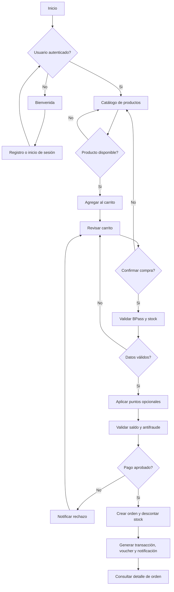

# Flujo principal de MusicPro

El proyecto seleccionado corresponde a **Sucursal y Punto de Venta**, con integración de BeatPay y fidelización.

## Rutas principales

- `/` muestra el catálogo y la bienvenida.
- `/usuarios/login/` y `/usuarios/registro/` gestionan el acceso.
- `/carrito/` permite revisar la selección.
- `/checkout/` valida BPass, stock, puntos, saldo y antifraude.
- `/pagos/comprobantes/` muestra los comprobantes.
- `/api/productos/` expone el CRUD de productos con escritura administrativa.
- `/api/pedidos/` devuelve los pedidos del usuario autenticado.
