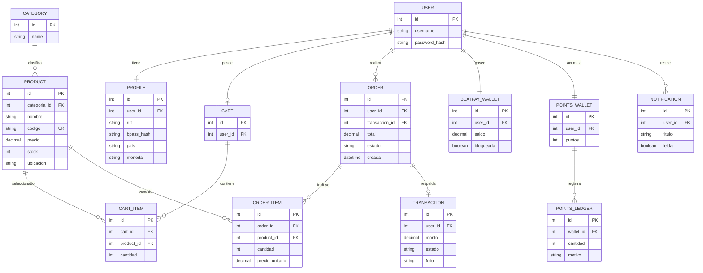

# Modelo de datos

```mermaid
erDiagram
    USER ||--|| PROFILE : tiene
    USER ||--o| CART : posee
    CART ||--o{ CART_ITEM : contiene
    PRODUCT ||--o{ CART_ITEM : seleccionado
    CATEGORY ||--o{ PRODUCT : clasifica
    USER ||--o{ ORDER : realiza
    ORDER ||--o{ ORDER_ITEM : incluye
    PRODUCT ||--o{ ORDER_ITEM : vendido
    ORDER ||--o| TRANSACTION : respalda
    USER ||--|| BEATPAY_WALLET : posee
    USER ||--|| POINTS_WALLET : acumula
    POINTS_WALLET ||--o{ POINTS_LEDGER : registra
    USER ||--o{ NOTIFICATION : recibe

    USER {
        int id PK
        string username
        string password_hash
    }
    PROFILE {
        int id PK
        int user_id FK
        string rut
        string bpass_hash
        string pais
        string moneda
    }
    CATEGORY {
        int id PK
        string name
    }
    PRODUCT {
        int id PK
        int categoria_id FK
        string nombre
        string codigo UK
        decimal precio
        int stock
        string ubicacion
    }
    CART {
        int id PK
        int user_id FK
    }
    CART_ITEM {
        int id PK
        int cart_id FK
        int product_id FK
        int cantidad
    }
    ORDER {
        int id PK
        int user_id FK
        int transaction_id FK
        decimal total
        string estado
        datetime creada
    }
    ORDER_ITEM {
        int id PK
        int order_id FK
        int product_id FK
        int cantidad
        decimal precio_unitario
    }
    TRANSACTION {
        int id PK
        int user_id FK
        decimal monto
        string estado
        string folio
    }
    BEATPAY_WALLET {
        int id PK
        int user_id FK
        decimal saldo
        boolean bloqueada
    }
    POINTS_WALLET {
        int id PK
        int user_id FK
        int puntos
    }
    POINTS_LEDGER {
        int id PK
        int wallet_id FK
        int cantidad
        string motivo
    }
    NOTIFICATION {
        int id PK
        int user_id FK
        string titulo
        boolean leida
    }
```

La implementación persistente se encuentra en los modelos de las aplicaciones Django y sus migraciones versionadas.
